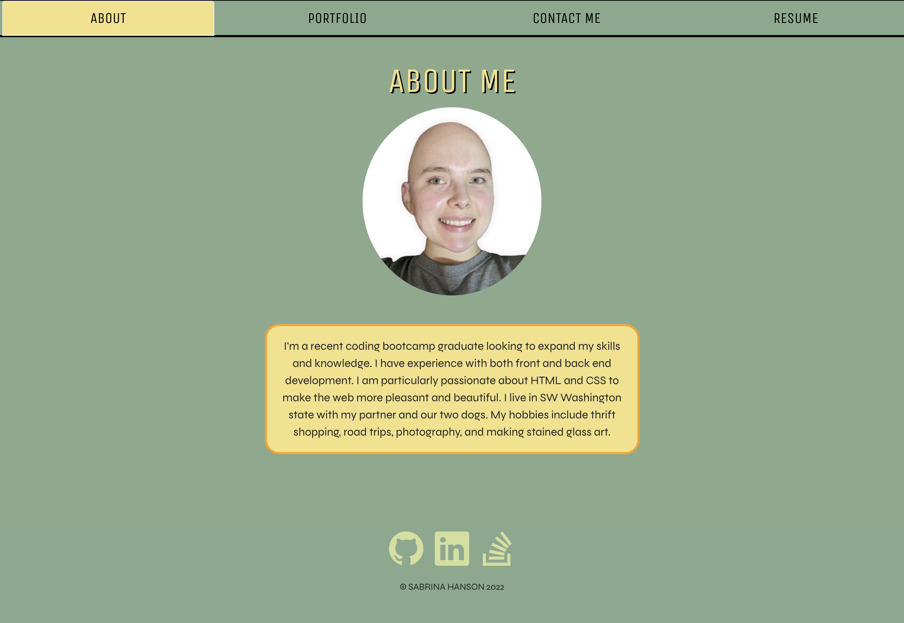
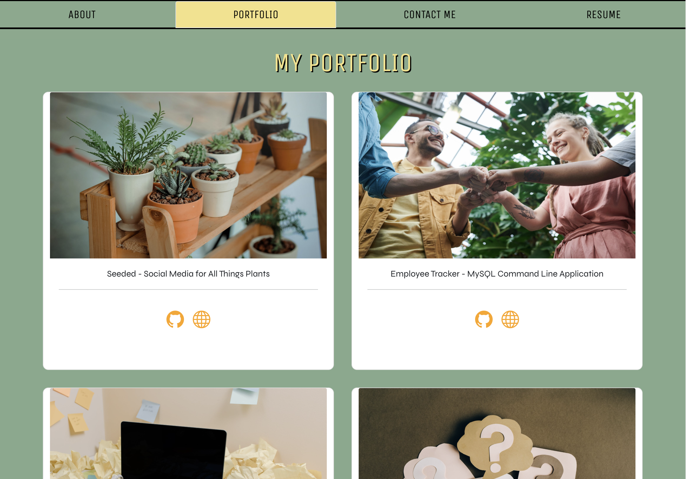
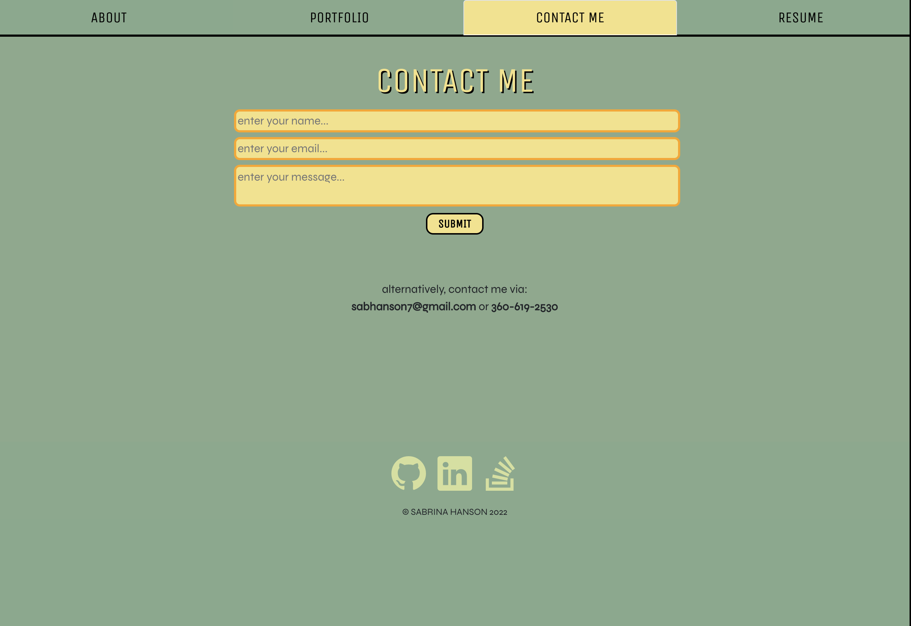
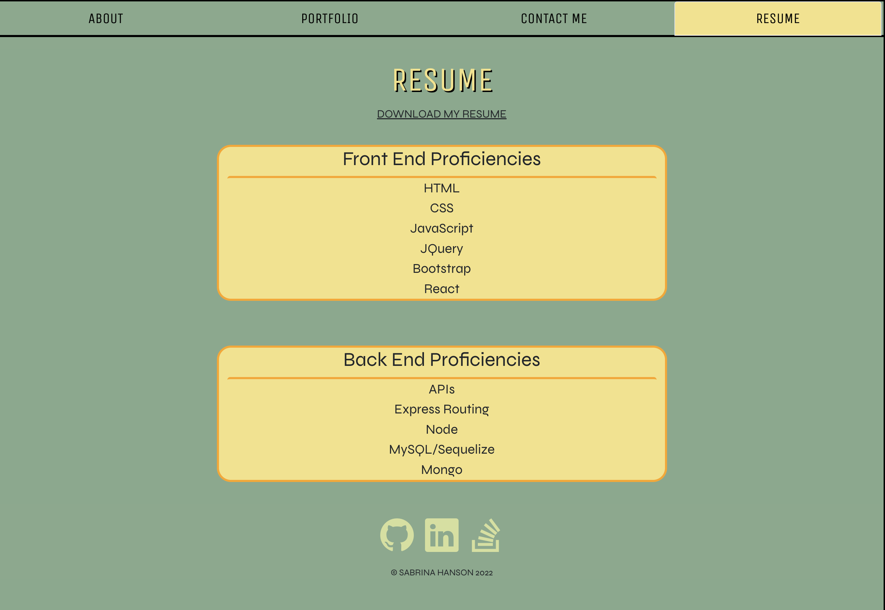

# React Portfolio 📁 [](https://opensource.org/licenses/MIT)

## Description

I built this portfolio using `React` so that employers can view my programming projects and contact me. I made it easy to navigate with mobile-first design. I have links to several of my coding applications for users to visit.

## Table of Contents

- [Installation](#installation)
- [Usage](#usage)
- [License](#license)
- [Contributing](#contributing)
- [Tests](#tests)
- [Badges](#badges)
- [Questions](#questions)

## Installation

- Clone [this repo](https://github.com/sabhanson/HW20-ReactPortfolio) from my Github to your local machine
- Open VSCode and run the following command in the built-in terminal to install the necessary node packages

```
npm install
```

- Run the following command to start the server

```
npm run start
```

- Congrats, you have successfully launched the server and are ready to view the site at `localhost:3000`

## Usage

[Visit the deployed Github site](https://sabhanson.github.io/HW20-ReactPortfolio/)

Here's a GIF of my Portfolio in use


### About

The about page features an image of me and a short bio



### Portfolio

The portfolio page features 6 cards with links to various projects I have created


### Contact Me

The contact page features a form for users to fill out with their name, email, and a message that they can send me


### Resume

The resume page features a downloadable link of my resume and two cards with information about the front end and back end skills that I have


## License

<p>
MIT License

Copyright &copy; 2022

Permission is hereby granted, free of charge, to any person obtaining a copy
of this software and associated documentation files (the "Software"), to deal
in the Software without restriction, including without limitation the rights
to use, copy, modify, merge, publish, distribute, sublicense, and/or sell
copies of the Software, and to permit persons to whom the Software is
furnished to do so, subject to the following conditions:

The above copyright notice and this permission notice shall be included in all
copies or substantial portions of the Software.

THE SOFTWARE IS PROVIDED "AS IS", WITHOUT WARRANTY OF ANY KIND, EXPRESS OR
IMPLIED, INCLUDING BUT NOT LIMITED TO THE WARRANTIES OF MERCHANTABILITY,
FITNESS FOR A PARTICULAR PURPOSE AND NONINFRINGEMENT. IN NO EVENT SHALL THE
AUTHORS OR COPYRIGHT HOLDERS BE LIABLE FOR ANY CLAIM, DAMAGES OR OTHER
LIABILITY, WHETHER IN AN ACTION OF CONTRACT, TORT OR OTHERWISE, ARISING FROM,
OUT OF OR IN CONNECTION WITH THE SOFTWARE OR THE USE OR OTHER DEALINGS IN THE
SOFTWARE.

  </p>

## Contributing

To contribute, please contact me via [Github](https://www.github.com/sabhanson) or [email](mailto:sabhanson7@gmail.com)

## Tests

Testing was all self-done in the terminal and console using the Google Chrome developer tools.

## Badges


## Questions

Contact me via [Github](https://www.github.com/sabhanson) or [email](mailto:sabhanson7@gmail.com)
